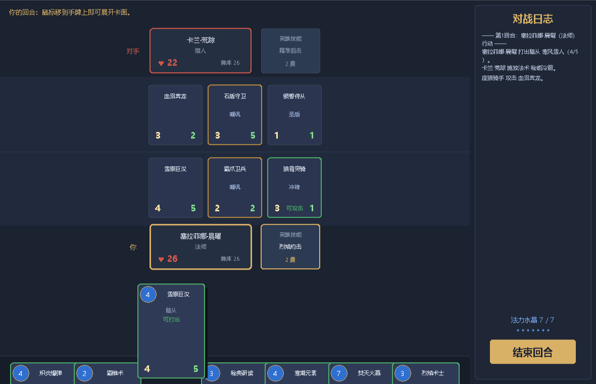
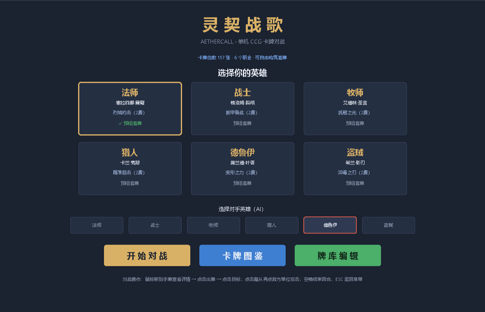
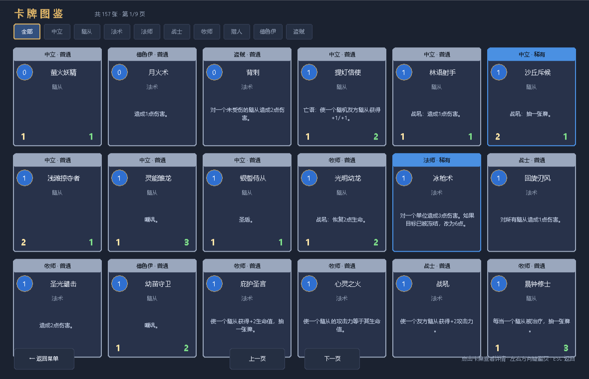
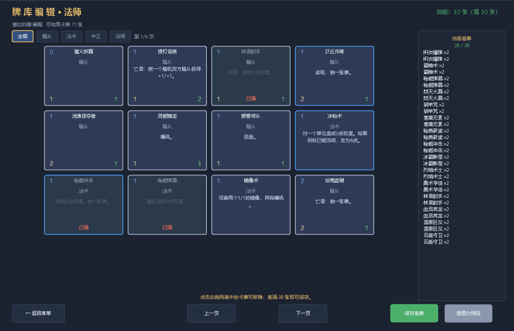

# 灵契战歌 · Aethercall

一款原创的单机 CCG（集换式卡牌）对战端游，使用 Python + tkinter 实现，**零第三方依赖**，双击即玩。

- 🎴 **157 张原创卡牌**，6 个职业英雄，可自由构筑 30 张套牌
- ⚔️ 完整回合制对战规则：法力成长、嘲讽、冲锋、圣盾、冻结、风怒、沉默、战吼、亡语、陷阱
- 🤖 启发式 AI 对手，会算斩杀线、判断换血是否划算、合理使用英雄技能
- 📖 内置卡牌图鉴与牌库编辑器，自建套牌自动存档

## 界面预览

### 对战界面
上下分屏的战场，手牌平时收在屏幕底部只露出一角，鼠标悬停时自动抬升展开完整卡面，右侧是法力水晶与实时战斗日志。



### 主菜单
选择自己的英雄与 AI 对手，一眼看到每个职业的英雄技能和当前使用的套牌。



### 卡牌图鉴
157 张卡牌分页浏览，可按职业、随从/法术筛选，点击任意卡牌查看放大详情。卡牌边框颜色代表稀有度：灰=普通、蓝=稀有、紫=史诗、金=传说。



### 牌库编辑器
左侧从可用卡池中挑选，右侧实时显示已选卡牌与张数校验，凑满 30 张即可保存。普通卡最多 2 张，传说卡限 1 张。



## 快速开始

1. 确保已安装 Python 3.10 或更高版本（Windows 请使用 [python.org 官方安装包](https://www.python.org/downloads/)，安装时勾选 `Add python.exe to PATH`）。
2. 双击 `start.bat`。
3. 在主菜单选择英雄，点击「开始对战」；或先进入「牌库编辑」自己搭一套牌。

也可以手动启动：

```bat
python main.py
```

无界面的规则自检（AI 互相对战 90 局）：

```bat
python main.py --sim
```

## 操作说明

| 操作 | 说明 |
| --- | --- |
| 鼠标移到手牌上 | 手牌平时只露出一角，悬停时自动抬升并展开完整卡面 |
| 点击手牌 | 打出卡牌；需要目标的会提示「请选择目标」，再次点击同一张可取消 |
| 点击目标 | 为法术或战吼指定随从/英雄 |
| 点击自己的随从 → 点击敌方单位 | 发起攻击 |
| 点击英雄技能按钮 | 消耗 2 点法力使用英雄技能，每回合一次 |
| 结束回合按钮 / 空格键 | 结束当前回合 |
| ESC | 返回主菜单 |
| ← → 方向键 | 在图鉴与牌库编辑界面翻页 |
| 点击空白区域 | 取消当前选择 |

界面自上而下依次为：对手英雄与技能、对手随从排、我方随从排、我方英雄与技能，最底部是手牌区，互不遮挡。随从边框含义：金色为嘲讽，绿色表示本回合可攻击，黄色高亮为当前可选目标。

## 游戏规则

- 双方英雄初始 30 点生命，法力水晶每回合 +1，上限 10。
- 先手起手 3 张牌，后手 4 张牌；每回合开始抽 1 张牌。
- 牌库抽空后开始受到疲劳伤害，每次递增 1 点。
- 手牌上限 10 张，超出的牌会被烧掉；战场上限 7 个随从。
- 随从入场当回合无法攻击，除非拥有「冲锋」。
- 对方存在「嘲讽」随从时，必须先攻击嘲讽随从。
- 英雄生命降至 0 即败北；双方同时归零判定平局。

## 关键词能力

| 关键词 | 效果 |
| --- | --- |
| 嘲讽 | 敌方必须优先攻击它 |
| 冲锋 | 入场当回合即可攻击 |
| 风怒 | 每回合可攻击两次 |
| 圣盾 | 免疫下一次伤害 |
| 冻结 | 下个回合无法攻击 |
| 沉默 | 移除随从的所有关键词、光环与亡语 |
| 光环 | 为其他友方随从提供属性加成 |
| 战吼 / 亡语 | 入场时或死亡时触发效果 |
| 法术强度 | 使你的法术伤害提高 |
| 陷阱 | 英雄被攻击时自动触发 |

## 英雄与卡池

6 个职业，每职业有专属卡牌，加上可共用的中立卡牌，构筑池约 64-71 张：

| 英雄 | 职业 | 英雄技能 | 风格 |
| --- | --- | --- | --- |
| 塞拉菲娜·晨曜 | 法师 | 烈焰灼击：造成 1 点伤害 | 法术爆发、控场清场 |
| 格洛姆·裂颅 | 战士 | 披甲备战：获得 2 点护甲 | 护甲成长、处决换牌 |
| 艾德林·圣言 | 牧师 | 抚慰之光：恢复 2 点生命 | 治疗续航、沉默消灭 |
| 卡兰·荒踪 | 猎人 | 精准狙击：对敌方英雄造成 2 点伤害 | 快攻压制、铺场蓄势 |
| 薇兰德·叶语 | 德鲁伊 | 变形之力：获得 1 点护甲并造成 1 点伤害 | 加速展开、大体型碾压 |
| 希兰·影刃 | 盗贼 | 淬毒之刃：对敌方随从造成 1 点伤害并抽一张牌 | 低费连招、抢节奏 |

稀有度分布：普通、稀有、史诗、传说。传说卡每套牌只能带 1 张。

## 牌库编辑器

进入主菜单点「牌库编辑」即可为当前选中的英雄自定义套牌：

- 左侧网格是可用卡池，可按随从/法术/职业/中立筛选，分页浏览
- 点击卡牌加入套牌，点击右侧列表中的条目移除
- 顶部实时显示张数与校验结果（需恰好 30 张，普通卡≤2 张，传说卡≤1 张）
- 保存后写入项目根目录的 `decks.json`，之后对战自动使用你的套牌
- 点「重置为预组」可恢复默认套牌

## 项目结构

```
├── start.bat          一键启动脚本（自动检测 Python 与 tkinter）
├── main.py            程序入口
├── decks.json         自定义套牌存档（保存后自动生成）
├── docs/              README 用界面截图
└── aethercall/
    ├── cards.py       157 张卡牌、6 个英雄、套牌校验规则
    ├── engine.py      回合流程、伤害结算、效果解析、胜负判定
    ├── ai.py          启发式 AI 对手
    ├── ui.py          tkinter 界面：菜单 / 对战 / 图鉴 / 构筑
    ├── decks.py       自定义套牌读写
    └── simulate.py    无界面 AI 对战自检
```

## 扩展卡牌

在 `aethercall/cards.py` 中追加一条定义即可，效果由 `engine.py` 的 `apply_effect` 统一解析：

```python
_minion("my_card", "我的随从", 3, 3, 4, "战吼：抽一张牌。",
        keywords=("taunt",),
        effects=[{"type": "draw", "target": "owner", "amount": 1}])
```

可用的效果类型：`damage`、`aoe`、`heal`、`mass_heal`、`draw`、`armor`、`buff`、`grant`、`freeze`、`destroy`、`polymorph`、`silence`、`random_damage`、`random_split`、`random_buff`、`summon`、`summon_per_enemy`、`give_mana`、`armor_damage`、`conditional_damage`、`set_attack_to_health`、`double_health`、`mark`、`trap_explosive`、`add_random_class_spells`。

可用的目标模式：`none`、`any_character`、`any_minion`、`friendly_minion`、`enemy_minion`、`damaged_enemy_minion`、`undamaged_minion`、`weak_minion`（攻击力≤3）、`strong_minion`（攻击力≥5）。

新卡会自动出现在图鉴和牌库编辑器中。改完运行 `python main.py --sim` 验证规则未被破坏。

## 常见问题

- **双击 bat 闪退**：说明 Python 未加入 PATH，请重新安装 Python 并勾选该选项。
- **提示缺少 tkinter**：多见于精简版/商店版 Python，请改用官方安装包。
- **想调整 AI 强度**：修改 `aethercall/ai.py` 中的评分权重，或在 `aethercall/ui.py` 里调整 AI 行动间隔。
- **套牌存档在哪**：项目根目录的 `decks.json`，删掉它即可全部恢复预组套牌。

## 声明

本项目为原创的个人学习作品，卡牌、英雄、数值与美术均为自行设计，不含任何第三方素材或授权内容。
